# Trozzi Admin Use Case Diagram

```plantuml
@startuml
!theme cerulean-outline

skinparam packageStyle rectangle
skinparam usecase {
    BackgroundColor<<Core>> LightBlue
    BorderColor<<Core>> DarkBlue
    BackgroundColor<<Analytics>> LightGreen
    BorderColor<<Analytics>> DarkGreen
    BackgroundColor<<User>> LightYellow
    BorderColor<<User>> Orange
    BackgroundColor<<Product>> LightPink
    BorderColor<<Product>> DarkRed
    BackgroundColor<<Order>> LightCoral
    BorderColor<<Order>> DarkRed
    BackgroundColor<<Content>> Lavender
    BorderColor<<Content>> Purple
}

title Trozzi E-Commerce Admin System - Use Case Diagram

rectangle "Admin System" {
    
    package "Authentication & Profile" as AuthPkg {
        usecase "Admin Login" <<Core>> as UC_Login
        usecase "View Admin Profile" <<Core>> as UC_Profile
        usecase "Token Validation" <<Core>> as UC_Token
    }
    
    package "Dashboard & Analytics" as AnalyticsPkg {
        usecase "View Dashboard" <<Analytics>> as UC_Dashboard
        usecase "View Analytics Overview" <<Analytics>> as UC_AnalyticsOverview
        usecase "View Real-time Analytics" <<Analytics>> as UC_Realtime
        usecase "View BI Analytics" <<Analytics>> as UC_BI
        usecase "Filter Analytics by Date" <<Analytics>> as UC_DateFilter
        usecase "View Notifications" <<Analytics>> as UC_Notifications
        usecase "Mark Notification Read" <<Analytics>> as UC_MarkRead
    }
    
    package "User Management" as UserPkg {
        usecase "View Users List" <<User>> as UC_ViewUsers
        usecase "Search Users" <<User>> as UC_SearchUsers
        usecase "Filter by Role" <<User>> as UC_FilterRole
        usecase "View User Cart" <<User>> as UC_ViewCart
        usecase "View User Orders" <<User>> as UC_ViewUserOrders
    }
    
    package "Product Management" as ProductPkg {
        usecase "View Products List" <<Product>> as UC_ViewProducts
        usecase "Search Products" <<Product>> as UC_SearchProducts
        usecase "Filter by Category" <<Product>> as UC_FilterCategory
        usecase "Create Product" <<Product>> as UC_CreateProduct
        usecase "Edit Product" <<Product>> as UC_EditProduct
        usecase "Delete Product" <<Product>> as UC_DeleteProduct
        usecase "View Product Details" <<Product>> as UC_ProductDetails
    }
    
    package "Category Management" as CategoryPkg {
        usecase "View Categories" <<Product>> as UC_ViewCategories
        usecase "Create Category" <<Product>> as UC_CreateCategory
        usecase "Edit Category" <<Product>> as UC_EditCategory
        usecase "Delete Category" <<Product>> as UC_DeleteCategory
        usecase "Search Categories" <<Product>> as UC_SearchCategories
    }
    
    package "Review Management" as ReviewPkg {
        usecase "View Reviews" <<Product>> as UC_ViewReviews
        usecase "Filter Reviews (Rating/Status)" <<Product>> as UC_FilterReviews
        usecase "Search Reviews" <<Product>> as UC_SearchReviews
        usecase "Update Review Status" <<Product>> as UC_UpdateReviewStatus
        usecase "Delete Review" <<Product>> as UC_DeleteReview
        usecase "View Review Statistics" <<Product>> as UC_ReviewStats
        usecase "Export Reviews to CSV" <<Product>> as UC_ExportReviews
    }
    
    package "Banner Management" as BannerPkg {
        usecase "View Banners" <<Content>> as UC_ViewBanners
        usecase "Create Banner" <<Content>> as UC_CreateBanner
        usecase "Edit Banner" <<Content>> as UC_EditBanner
        usecase "Delete Banner" <<Content>> as UC_DeleteBanner
        usecase "Toggle Banner Status" <<Content>> as UC_ToggleBanner
        usecase "Upload Banner Image" <<Content>> as UC_UploadBanner
        usecase "Filter by Position" <<Content>> as UC_FilterPosition
    }
    
    package "Order & Shipment Management" as OrderPkg {
        usecase "View Orders" <<Order>> as UC_ViewOrders
        usecase "Mark Order Delivered" <<Order>> as UC_MarkDelivered
        usecase "View Refund Requests" <<Order>> as UC_ViewRefunds
        usecase "Approve Refund Request" <<Order>> as UC_ApproveRefund
        usecase "Retry Shipment" <<Order>> as UC_RetryShipment
        usecase "Cancel Shipment" <<Order>> as UC_CancelShipment
        usecase "Sync AWB (Tracking)" <<Order>> as UC_SyncAWB
        usecase "Initiate PhonePe Refund" <<Order>> as UC_PhonePeRefund
    }
    
    package "Content Settings" as SettingsPkg {
        usecase "View Content Settings" <<Content>> as UC_ViewSettings
        usecase "Update Brand Logo" <<Content>> as UC_UpdateLogo
        usecase "Update Default Avatar" <<Content>> as UC_UpdateAvatar
        usecase "Configure Bio Max Length" <<Content>> as UC_BioLength
        usecase "Toggle Order History Display" <<Content>> as UC_ToggleOrderHistory
        usecase "Toggle Wishlist Count" <<Content>> as UC_ToggleWishlist
        usecase "Toggle Profile Editing" <<Content>> as UC_ToggleProfileEdit
        usecase "Toggle COD Option" <<Content>> as UC_ToggleCOD
    }
}

' Actors
actor "Admin" as Admin
actor "System" as System

' Actor relationships
Admin --> UC_Login
Admin --> UC_Dashboard
Admin --> UC_ViewUsers
Admin --> UC_ViewProducts
Admin --> UC_ViewCategories
Admin --> UC_ViewReviews
Admin --> UC_ViewBanners
Admin --> UC_ViewOrders
Admin --> UC_ViewSettings
Admin --> UC_Notifications

' Include relationships (mandatory)
UC_Dashboard ..> UC_AnalyticsOverview : <<include>>
UC_Login ..> UC_Token : <<include>>
UC_ViewUsers ..> UC_SearchUsers : <<include>>
UC_ViewProducts ..> UC_SearchProducts : <<include>>
UC_ViewReviews ..> UC_ReviewStats : <<include>>
UC_ViewBanners ..> UC_ViewBanners : <<include>>

' Extend relationships (optional)
UC_AnalyticsOverview ..> UC_Realtime : <<extend>>
UC_AnalyticsOverview ..> UC_BI : <<extend>>
UC_ViewUsers ..> UC_ViewCart : <<extend>>
UC_ViewUsers ..> UC_ViewUserOrders : <<extend>>
UC_ViewProducts ..> UC_CreateProduct : <<extend>>
UC_ViewProducts ..> UC_EditProduct : <<extend>>
UC_ViewProducts ..> UC_DeleteProduct : <<extend>>
UC_ViewProducts ..> UC_ProductDetails : <<extend>>
UC_ViewCategories ..> UC_CreateCategory : <<extend>>
UC_ViewCategories ..> UC_EditCategory : <<extend>>
UC_ViewCategories ..> UC_DeleteCategory : <<extend>>
UC_ViewReviews ..> UC_UpdateReviewStatus : <<extend>>
UC_ViewReviews ..> UC_DeleteReview : <<extend>>
UC_ViewReviews ..> UC_ExportReviews : <<extend>>
UC_ViewBanners ..> UC_CreateBanner : <<extend>>
UC_ViewBanners ..> UC_EditBanner : <<extend>>
UC_ViewBanners ..> UC_DeleteBanner : <<extend>>
UC_ViewBanners ..> UC_ToggleBanner : <<extend>>
UC_ViewOrders ..> UC_MarkDelivered : <<extend>>
UC_ViewOrders ..> UC_ViewRefunds : <<extend>>
UC_ViewOrders ..> UC_RetryShipment : <<extend>>
UC_ViewOrders ..> UC_CancelShipment : <<extend>>
UC_ViewOrders ..> UC_SyncAWB : <<extend>>

' System relationships
System --> UC_Token
System --> UC_Realtime
System --> UC_Notifications

@enduml
```

---

## Use Case Descriptions

### 1. Authentication & Profile
| Use Case | Description |
|----------|-------------|
| Admin Login | Admin authenticates with email and password, receives JWT token |
| View Admin Profile | Admin views their own profile details |
| Token Validation | System validates JWT token for protected routes |

### 2. Dashboard & Analytics
| Use Case | Description |
|----------|-------------|
| View Dashboard | Main admin dashboard with overview metrics |
| View Analytics Overview | Revenue, orders, visitors, conversion rate analytics |
| View Real-time Analytics | Live active users, orders per minute, page views |
| View BI Analytics | Business intelligence with top/low performing products |
| View Notifications | System notifications for admin |
| Mark Notification Read | Mark single or all notifications as read |

### 3. User Management
| Use Case | Description |
|----------|-------------|
| View Users List | Paginated list of all users with stats |
| Search Users | Search by name, email, phone |
| Filter by Role | Filter users by role |
| View User Cart | View items in user's cart |
| View User Orders | View order history of specific user |

### 4. Product Management
| Use Case | Description |
|----------|-------------|
| View Products List | Paginated product listing |
| Search Products | Search by name, description, SKU, brand |
| Filter by Category | Filter products by category |
| Create Product | Add new product with all details |
| Edit Product | Modify existing product |
| Delete Product | Remove product from system |
| View Product Details | View complete product information |

### 5. Category Management
| Use Case | Description |
|----------|-------------|
| View Categories | List all product categories |
| Create Category | Add new category |
| Edit Category | Update category details |
| Delete Category | Remove category |
| Search Categories | Search by name or description |

### 6. Review Management
| Use Case | Description |
|----------|-------------|
| View Reviews | List all product reviews |
| Filter Reviews | Filter by rating (1-5) or status (pending/approved/rejected) |
| Search Reviews | Search by customer name, email, title, comment |
| Update Review Status | Approve or reject reviews |
| Delete Review | Remove review permanently |
| View Review Statistics | Total reviews, average rating, status counts |
| Export Reviews | Download reviews as CSV |

### 7. Banner Management
| Use Case | Description |
|----------|-------------|
| View Banners | List all promotional banners |
| Create Banner | Add new banner with image, title, link |
| Edit Banner | Update banner details |
| Delete Banner | Remove banner |
| Toggle Banner Status | Enable/disable banner |
| Upload Banner Image | Upload image to S3 |
| Filter by Position | Filter by banner position (home, category, etc.) |

### 8. Order & Shipment Management
| Use Case | Description |
|----------|-------------|
| View Orders | List all customer orders |
| Mark Order Delivered | Manually mark order as delivered |
| View Refund Requests | List pending/approved refund requests |
| Approve Refund Request | Approve and process refund |
| Retry Shipment | Retry failed Shiprocket shipment |
| Cancel Shipment | Cancel shipment before pickup |
| Sync AWB | Synchronize Airway Bill from Shiprocket |
| Initiate PhonePe Refund | Trigger refund via PhonePe |

### 9. Content Settings
| Use Case | Description |
|----------|-------------|
| View Content Settings | View current platform settings |
| Update Brand Logo | Change brand logo URL |
| Update Default Avatar | Set default user avatar |
| Configure Bio Max Length | Set max character limit for user bio |
| Toggle Order History Display | Show/hide order history on profiles |
| Toggle Wishlist Count | Show/hide wishlist count |
| Toggle Profile Editing | Enable/disable profile editing for users |
| Toggle COD Option | Enable/disable Cash on Delivery |

---

## File Location
`c:\Users\computer\Downloads\trozzi\trozzi\trozzi\admin-use-case-diagram.md`

To view the diagram, you can:
1. Use a PlantUML plugin in VS Code (like "PlantUML")
2. Online editor: [plantuml.com/plantuml](https://plantuml.com/plantuml)
3. Copy the code and paste into any PlantUML renderer
