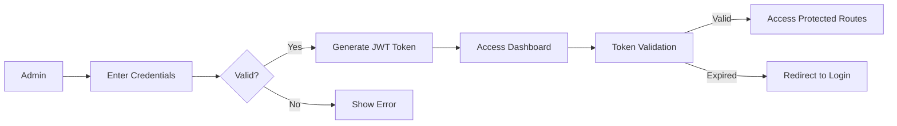
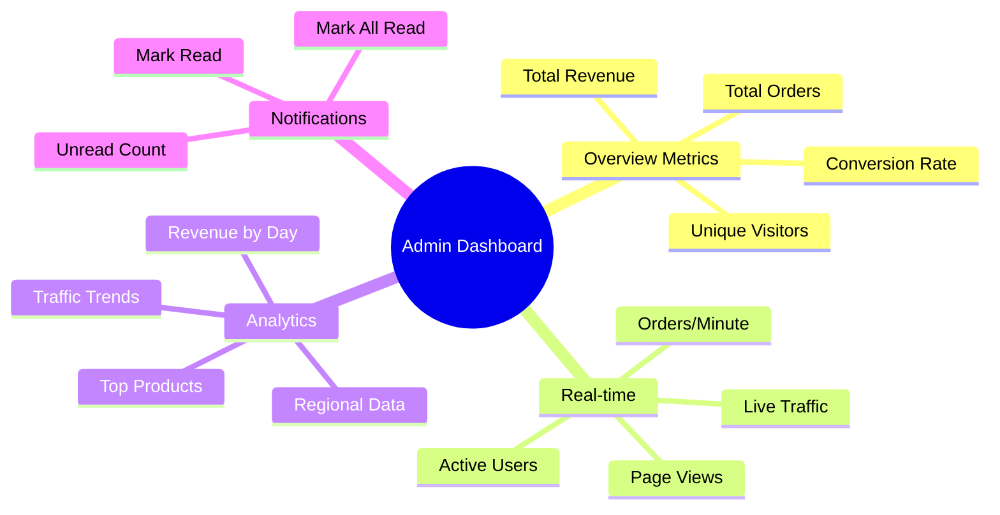
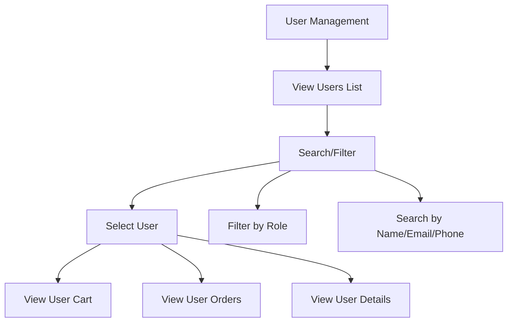
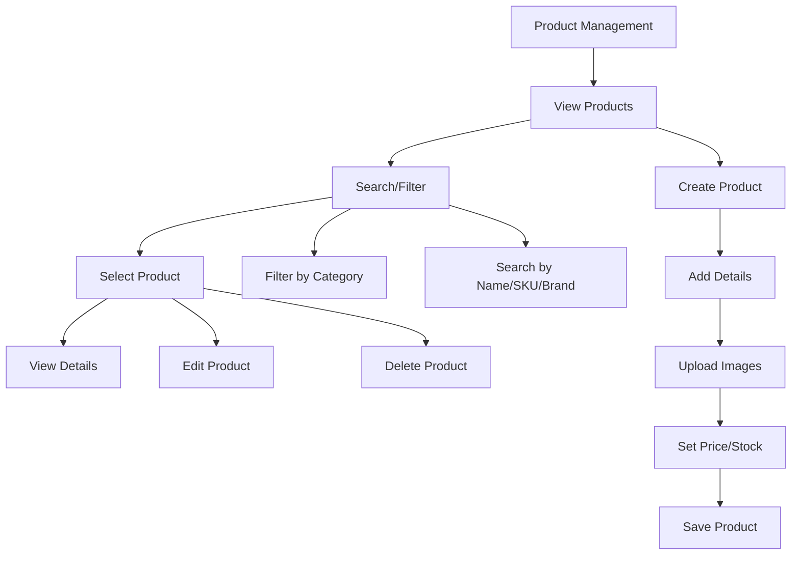
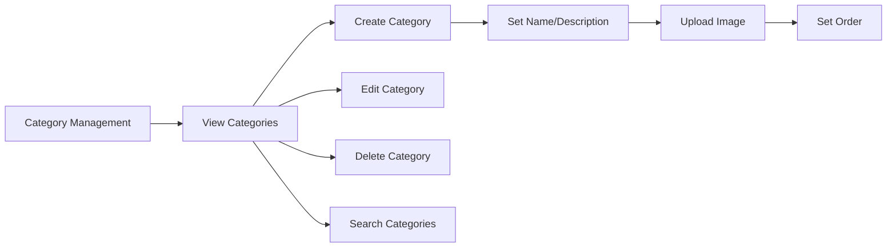
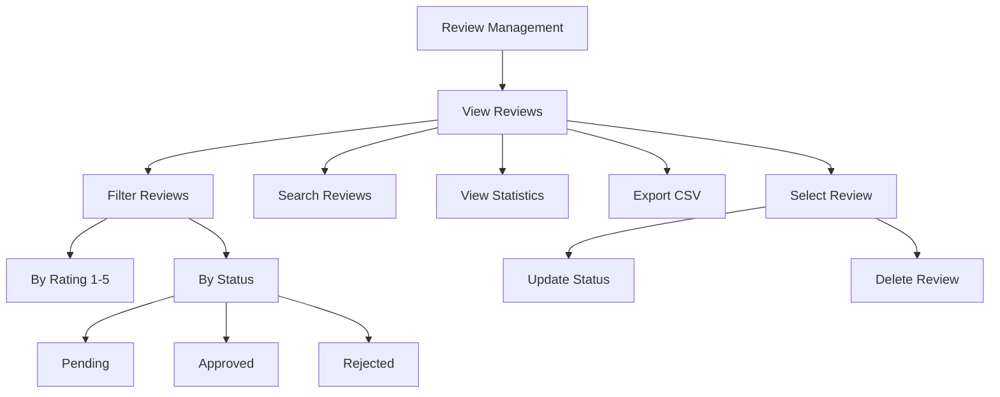
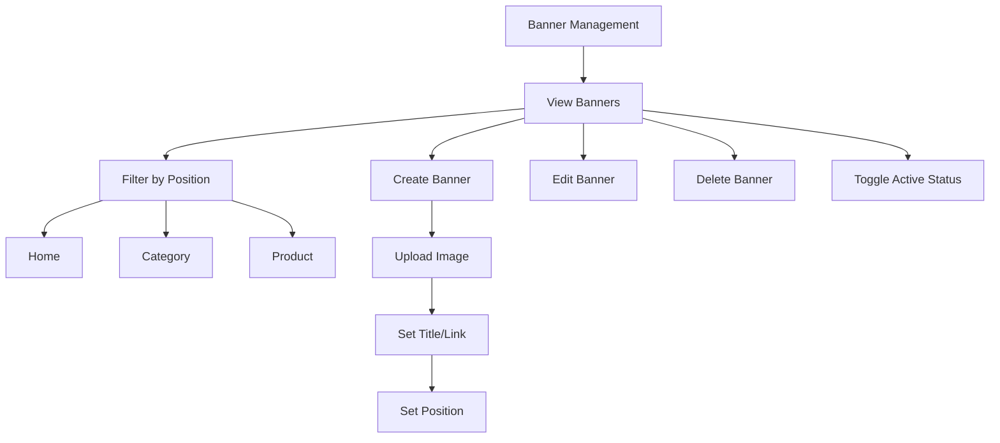
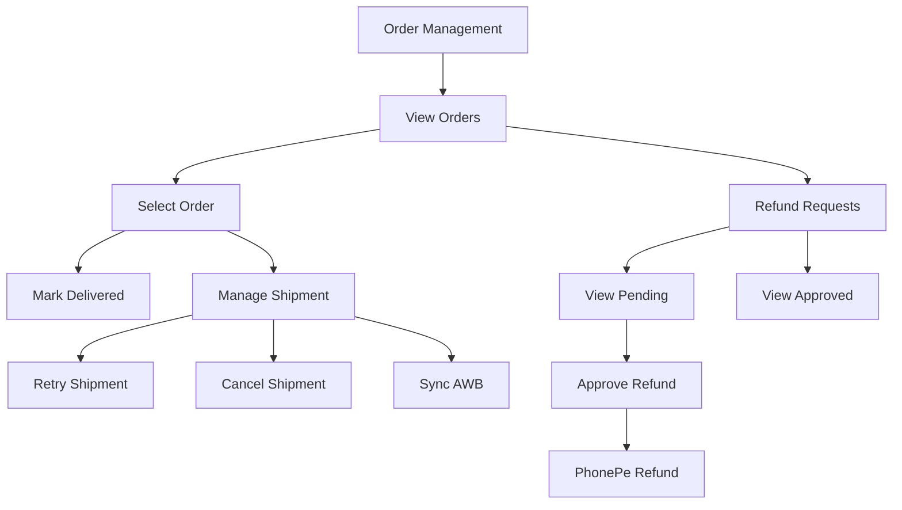
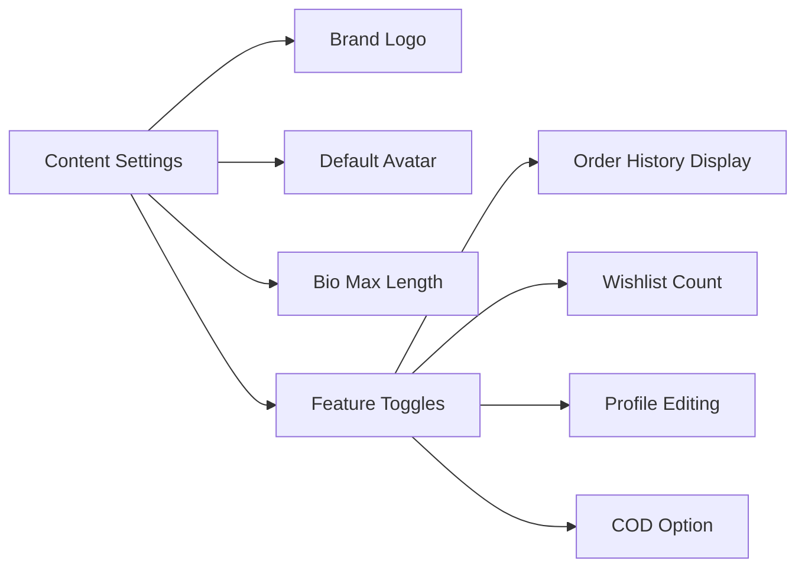

# Trozzi Admin Use Case Diagram (Mermaid)

## Full Use Case Diagram

```mermaid
flowchart TB
    subgraph Actors
        A[👤 Admin]
        S[⚙️ System]
    end

    subgraph "🔐 Authentication"
        UC1[Admin Login]
        UC2[View Profile]
        UC3[Token Validation]
    end

    subgraph "📊 Dashboard & Analytics"
        UC4[View Dashboard]
        UC5[Analytics Overview]
        UC6[Real-time Analytics]
        UC7[BI Analytics]
        UC8[View Notifications]
        UC9[Mark Notification Read]
    end

    subgraph "👥 User Management"
        UC10[View Users]
        UC11[Search Users]
        UC12[Filter by Role]
        UC13[View User Cart]
        UC14[View User Orders]
    end

    subgraph "📦 Product Management"
        UC15[View Products]
        UC16[Search Products]
        UC17[Filter by Category]
        UC18[Create Product]
        UC19[Edit Product]
        UC20[Delete Product]
        UC21[View Product Details]
    end

    subgraph "📁 Category Management"
        UC22[View Categories]
        UC23[Create Category]
        UC24[Edit Category]
        UC25[Delete Category]
    end

    subgraph "⭐ Review Management"
        UC26[View Reviews]
        UC27[Filter by Rating/Status]
        UC28[Search Reviews]
        UC29[Update Review Status]
        UC30[Delete Review]
        UC31[View Review Stats]
        UC32[Export to CSV]
    end

    subgraph "🎯 Banner Management"
        UC33[View Banners]
        UC34[Create Banner]
        UC35[Edit Banner]
        UC36[Delete Banner]
        UC37[Toggle Banner Status]
        UC38[Upload Banner Image]
    end

    subgraph "🚚 Order & Shipment"
        UC39[View Orders]
        UC40[Mark Delivered]
        UC41[View Refund Requests]
        UC42[Approve Refund]
        UC43[Retry Shipment]
        UC44[Cancel Shipment]
        UC45[Sync AWB Tracking]
        UC46[PhonePe Refund]
    end

    subgraph "⚙️ Content Settings"
        UC47[View Settings]
        UC48[Update Brand Logo]
        UC49[Update Default Avatar]
        UC50[Configure Bio Length]
        UC51[Toggle Order History]
        UC52[Toggle Wishlist Count]
        UC53[Toggle Profile Edit]
        UC54[Toggle COD Option]
    end

    A --> UC1 & UC4 & UC10 & UC15 & UC22 & UC26 & UC33 & UC39 & UC47 & UC8
    S --> UC3 & UC6 & UC8
```

---

## Simplified Use Case Diagram by Module

### 1. Authentication Flow

### 2. Dashboard & Analytics

### 3. User Management

### 4. Product Management

### 5. Category Management

### 6. Review Management

### 7. Banner Management

### 8. Order & Shipment Management

### 9. Content Settings

---

## Use Case Summary Table

| Module | Total Use Cases | Core Functions |
|--------|-----------------|----------------|
| Authentication | 3 | Login, Profile, Token |
| Dashboard | 7 | Overview, Analytics, Notifications |
| User Mgmt | 5 | CRUD + Cart/Orders |
| Product Mgmt | 7 | CRUD + Search/Filter |
| Category Mgmt | 5 | CRUD + Search |
| Review Mgmt | 7 | CRUD + Stats + Export |
| Banner Mgmt | 6 | CRUD + Toggle + Upload |
| Order Mgmt | 8 | Orders + Shipments + Refunds |
| Settings | 8 | View + 7 Update functions |
| **TOTAL** | **56** | Complete Admin Suite |

---

## File Location
`c:\Users\computer\Downloads\trozzi\trozzi\trozzi\admin-use-case-mermaid.md`
